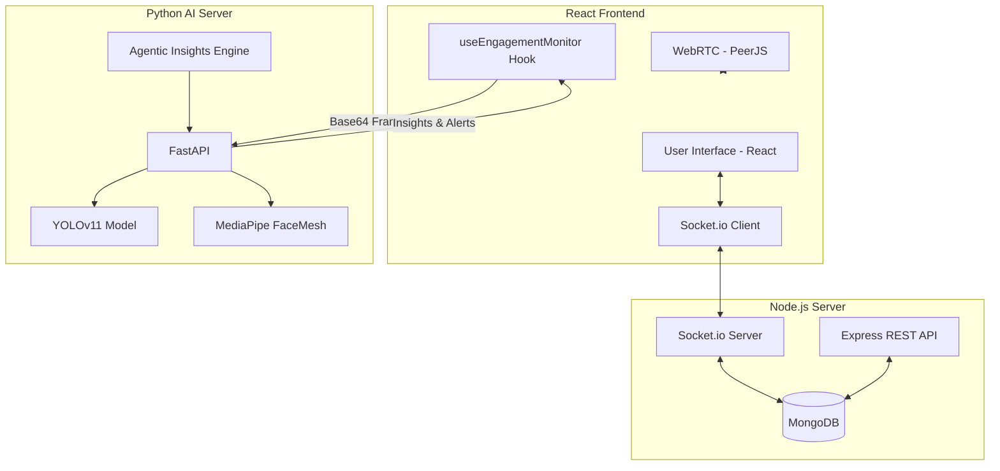

# SmartMeet - AI-Powered Virtual Classroom & Google Meet Clone

SmartMeet is a production-grade, full-stack video conferencing platform designed for virtual classrooms. It combines robust WebRTC-based communication with state-of-the-art **YOLOv11 Computer Vision** and **Agentic AI Insights** to monitor student engagement in real-time.

---

## 🏗️ System Architecture



---

## 🚀 Key Features in Detail

### 💻 Core Meeting Experience
- **One-Click Meetings**: Generate unique UUID-based rooms instantly.
- **Role-Based Controls (Host vs Participant)**:
    - **Host**: Can mute/unmute anyone, kick users, end the meeting for all, and approve/deny screen share requests.
    - **Participant**: Can request to share screen, raise hand, and self-mute.
- **Advanced Screen Sharing**: Secure workflow requiring host manual approval before a participant's screen is broadcast.
- **Real-Time Participant List**: Live status tracking (Host badge, Mute status, Video status).
- **In-Call Chat**: Persistent chat during the session with the ability to **Export Chat as CSV** for post-meeting review.
- **Live Reactions**: Interactive emoji flying animations to boost engagement.

### 🤖 AI-Powered Monitoring (YOLOv11 & MediaPipe)
The system uses a dedicated Python AI server to analyze student behavior through their webcam:
- **Detection Classes**:
    - **Attentive**: Person detected, face looking forward, eye activity normal.
    - **Drowsiness (EAR)**: Monitors Eye Aspect Ratio (EAR) to detect closed eyes or sleepiness.
    - **Posture Detection**: Tracks head position vs frame standards to detect slumping or poor ergonomic posture.
    - **Distracted**: Looking away for prolonged periods (Pitch/Yaw detection).
    - **Multi-Device Distraction**: Detection of mobile devices (phone) or secondary laptops/tablets.
    - **Multiple People**: Detecting more than one person in the frame (detects possible cheating).
    - **No Face**: Alert when the camera is empty or the student leaves the seat.
- **Hardware Optimized**: Frames are resized to 640px and processed at ~1.5s intervals to balance accuracy and performance.

### 🧠 Agentic AI Insights Engine
The "Agentic" layer goes beyond simple detection by providing high-level reasoning:
- **Behavior Timeline**: Tracks a rolling timeline of statuses for granular reporting.
- **60s Sliding Window**: Maintains a rolling historical buffer of the student's behavior.
- **Engagement Score**: Calculates a dynamic 0-100% score based on weighted ratios of behavior (Attentive, Posture, Sleepiness).
- **Actionable AI Suggestions**:
    - *"Student appears drowsy — suggest a short stretch."*
    - *"Consistent poor posture — remind student to sit straight."*
    - *"Frequent phone use detected — intervention required."*
- **Host Alerts**: Critical behavior (like phone usage or multiple people) triggers a real-time toast notification for the teacher.

---

## 📂 Project Structure

```
SmartMeet/
├── client/                 # React frontend (Vite + Tailwind)
│   ├── src/hooks/          # useWebRTC, useSocket, useEngagementMonitor
│   ├── src/store/          # Zustand State Management (Auth, Meeting)
│   ├── src/components/     # AIAlertToast, TeacherDashboard, MeetingControls
│   └── src/pages/          # MeetingRoom, Login, Register, Home
├── server/                 # Node.js Express backend
│   ├── routes/             # auth.js, meeting.js, report.js
│   ├── models/             # MongoDB Schema definitions
│   ├── middleware/         # Auth verification guards
│   └── socketControllers/  # meetingHandlers.js (Real-time logic)
└── ai_server/              # Python AI Monitoring Service
    ├── main.py             # YOLOv11 & MediaPipe implementation
    ├── requirements.txt    # Python dependencies
    └── yolo11n.pt          # Pre-trained YOLO model (auto-downloaded)
```

---

## 🚦 Installation & Setup

### 1. Prerequisites
- Node.js v18+
- Python 3.9+
- MongoDB (Local or Atlas)

### 2. Backend (Node.js)
```bash
cd server
npm install
```
Create a `.env` file:
```env
PORT=5002
MONGO_URI=your_mongodb_connection_string
JWT_SECRET=your_jwt_secret
```
Run: `npm start`

### 3. AI Server (Python)
```bash
cd ai_server
python -m venv venv
# Windows: venv\Scripts\activate | Linux/Mac: source venv/bin/activate
pip install -r requirements.txt
uvicorn main:app --host 0.0.0.0 --port 8000
```

### 4. Frontend (React)
```bash
cd client
npm install
```
Create a `.env` file:
```env
VITE_API_URL=http://localhost:5002
VITE_AI_SERVER_URL=http://localhost:8000
```
Run: `npm run dev`

---

## 🔌 API & Socket Documentation

### REST API Reference
| Endpoint | Method | Description |
|---|---|---|
| `/api/auth/register` | POST | User registration |
| `/api/auth/login` | POST | User login & JWT generation |
| `/api/meetings` | POST | Initialize a new meeting session |
| `/api/meetings/join` | PUT | Log a participant joining a meeting |
| `/api/report` | GET | Fetch engagement reports for a specific meeting |

### Real-Time Socket Events
- **`join-room`**: Client sends room ID and user profile.
- **`participants-update`**: Server broadcasts the current list of participants and their roles.
- **`mute-user / unmute-user`**: Host commands to toggle a specific user's audio.
- **`request-screen-share` / `approve-screen-share`**: Permission-based sharing workflow.
- **`ai-alert`**: Broadcasts AI-detected behavior (e.g., phone detected) from the student to the host.

---

## 🛠️ Troubleshooting

- **Webcam Access**: Ensure you are running on `localhost` or `HTTPS`. Browsers block camera access on non-secure HTTP origins.
- **Port Conflicts**:
    - Backend: `5002`
    - AI Server: `8000`
    - Frontend: `5173`
- **PeerJS Connection**: If video doesn't load, check the browser console for `PeerJS` heartbeat errors. Ensure your firewall allows WebRTC traffic.

---

## 📜 License
SmartMeet is designed for educational innovation. Developed by Antigravity (Advanced Agentic AI Assistant).
